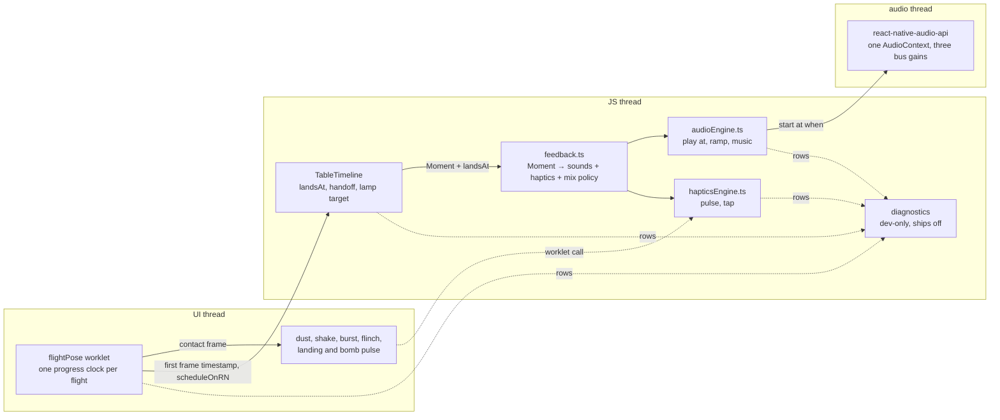

# The lantern table, done properly: design for #1259 (2026-09-28)

> **Where this spec and the plans differ, the plans win:**
> - The API is `event(moments, at)`, not `moment(m, at)`.
> - The count drops at the throw, with no departing backs (plan 2).
> - Band heights live in `tableFrame.ts` (plan 3).
> - The lamp's default and "you" y are 380 (D1).
> - The exchange prompt is on the turn chip and autopass is a float (plans 2 and 5).
> - Tolerance is 20 ms, not ±25.
> - The missing-play window is 150 ms (plan 1).

The owner's review of #1259 found fourteen defects on an iPhone and rejected the table as a proof
of concept. `docs/research/2026-09-28-lantern-review.md` measured each one; this document decides
how each class is fixed. The six plans beside it (`docs/plans/2026-09-28-1259-*.md`) turn it into
tasks.

## What the owner asked for

In the owner's words (#1259, comment 5870135066, and the brief for this session):

- The sound effects are "not timed, not behaving, not optimised, and not always working".
- "Build the mockup's flight (380 ms, 45 ms stagger, −24 pt lift, +0.1 scale pop, ease-out)."
- The dust "is enough to time it to when the card touches table".
- "The best available solution everywhere. No workarounds, no shortcuts. Replace any library
  that cannot meet the bar. Everything fully tested, and the game optimal without losing quality."
- No phone experiments from the owner in this session; checks on the phone happen once, later,
  and must ask little of them.

**Success** is the fourteen findings gone on the owner's iPhone, each class guarded by a check
that goes red on its next instance, and every device-only property held by a device gate that
measures itself.

## Architecture in one picture



Three owners replace today's scattered calls:

| Owner | Only it may | Guard |
|---|---|---|
| `lib/device/audioEngine.ts` | import react-native-audio-api | a test that lists the library's importers and expects exactly this file |
| `lib/device/hapticsEngine.ts` | import react-native-turbo-haptics | the same importer test |
| `lib/device/feedback.ts` | turn a `Moment` into sound, haptics and mix decisions | every sound or haptic outside it is a lint error (`no-restricted-imports` on the two engines, allowing only `feedback.ts`) |

Today 14 files call `lib/device/haptics.ts` or `sounds.ts` directly (menus, `GameTable.tsx`
calling `playRoundStart` itself). They move to `feedback.ts`: menus get `uiFeedback(kind)`, the
table gets `moment(m, at?)`.

## 1. Audio and haptics engine (#1, #2, #5, #6, #7, #10)

expo-audio and expo-haptics are replaced by **react-native-audio-api 0.13.6** (Software Mansion;
the Web Audio API on native, one `AudioContext` for effects and music, audio rendered on its own
thread) and **react-native-turbo-haptics 1.2.0** (cached generators, callable from a UI worklet),
both pinned exactly (ADR-0009). An owned C++ engine was designed and set aside by the owner: the
library's scheduling error (one IO buffer, 10–21 ms) is below what a player hears, and the
library's known defects each have a guard below.

On web the same facade runs over the browser's own Web Audio, which the app already uses; the
library's web build wraps it.

Music moves from ALAC/WebM to FLAC (lossless conversion, 48 kHz), because the library cannot
decode WebM on Android. The FLAC files live where their names cannot collide with the old tracks
as Android raw resources (a probe build failed on `menu.flac` beside `menu.webm`).

### The facade

```ts
// lib/device/audioEngine.ts — the only importer of react-native-audio-api
export type Bus = "sfx" | "sting" | "music";
export function startAudio(): Promise<void>;          // decode effects, open the device; idempotent
export function play(id: SoundId, o?: { at?: number; gain?: number; bus?: Bus }): void;
export function ramp(bus: Bus, gain: number, o: { at?: number; ms: number }): void;
export function music(track: TrackId | null, o?: { crossfadeMs?: number; at?: number }): void;
export function audioState(): "running" | "suspended" | "failed";
```

`at` is a `performance.now()` time in ms; absent means now. Nothing here returns a promise after
start, nothing touches the session, and there is no seek, pause or stop of a clip: an effect is a
fresh buffer source started at a time.

### How the engine is used

- **One context, started at app launch** and resumed once, so the first tap never starts the
  audio driver on the JS thread (the library runs a stopped driver's start synchronously on the
  caller). Never suspended in the foreground.
- **Time to the audio clock.** `play(id, {at})` computes `when = ctx.currentTime + (at −
  performance.now()) / 1000` at the call and starts the source at `when`. The error is the
  `currentTime` step (one IO buffer) plus output latency, bounded by the device gate; if the gate
  fails, the next step is reading `AVAudioSession.outputLatency` into the offset, not a new engine.
- **Plays are dropped, not queued, while the context is not `running`.** The library replays
  every play queued while suspended at the instant of resume; this is also the class behind a
  sting sounding after the screen has moved on.
- **Effects decoded once** at start into `AudioBuffer`s from `expo-asset` `localUri` (not base64).
  A play is `createBufferSource` + `connect(bus)` + `start(when)`: no seek, no cold start,
  polyphonic. No `onEnded` on effects (upstream #1285).
- **Buses.** Three `GainNode`s (`sfx`, `sting`, `music`) into the destination. Fades and ducks
  are `setValueAtTime` / `linearRampToValueAtTime` on the audio clock, never a JS interval.
- **Music.** Each track a looped `AudioBufferSourceNode` over decoded PCM (about 10.5 MB per
  track; the current and the next resident). A switch is two ramps at one time. It never pauses
  anything and never touches the session, so the music-death mechanism (`deactivateSession()`
  under a cold player) cannot exist.
- **Never from a worklet.** The library's host objects keep unsynchronised per-runtime caches, so
  only the JS thread calls it. Sounds for UI-thread moments are scheduled from JS at the throw.

### Session and lifecycle

- **iOS.** Category `.playback` (plays in silent mode, as today) with `.mixWithOthers` (D7); never
  `.duckOthers`, which would duck the player's own music for the whole run. The session is
  configured once through the library's `AudioManager`. The library forces `setActive(YES)` on
  every engine start; plan 1 decides from its source whether `disableSessionManagement()` plus one
  activation of our own is needed, the rule being that nothing activates per play.
- **Background and foreground.** The context is suspended on `AppState` background and resumed on
  active. An effective resume restarts the library's engine; that is once per foreground, not per
  play.
- **Route changes and interruptions** are handled by the library (it rebuilds the engine on main
  after a route change: rare, and measured by the soak).
- **Android.** The library's Oboe stream; the config plugin's defaults are turned off (no
  background audio, no foreground service or its permissions; FFmpeg and static-lib downloads
  disabled).
- **Web.** One `AudioContext` at load, resumed by the first gesture (the browser's rule), suspended
  on `visibilitychange`.
- **Watchdog.** If the context is not `running` after a resume (upstream #1230), it is recreated
  and the buffers re-bound. It never throws into the game.

### Mixing policy: one event sounds one thing

`lib/device/feedback.ts` turns moments into sound, haptics and ducking. `MOMENTS satisfies
Record<MomentKind, MomentSpec>`, so an unmapped moment is a compile error, and each spec names its
sound, its haptic, its bus and its **priority**. The table hands over every moment one game-state
change produced in a single call, `feedback.event(moments, at)`; the engine is asked for the
highest-priority sound only (`round_win` over `pass` over `turn`), which removes the 31 pile-ups
by construction. The turn cue is its own event at the hand-off that follows the landing
(`endsAt + Hold.land`, 175 ms after the flight's end, as in the mockup), not at the commit.

Stings play on the `sting` bus and duck `music` by 9 dB over 60 ms, returning over 400 ms after the
sting's end, all as scheduled ramps. A sting lives in the engine, not on a component timer, so the
table's unmount cannot cancel it, and the results screen's music switch is scheduled for the
sting's end. `partitaOver` gets its caller. A neutral manche gets a sound or not per the owner's
decision.

### Haptics

- **Landing and bomb pulses** fire from the UI worklet on the contact frame through
  turbo-haptics, which is built for that call; a prepared generator's fire is a small main-thread
  cost, and the tap gate below measures it.
- **Taps** fire from JS through the same library's cached generators, which it re-prepares after
  each fire. It drops them on resign-active, so the first haptic after returning to the app comes
  from a fresh generator; plan 1 re-prepares on becoming active if the API allows it. Its
  `init(style:)` is deprecated at iOS 27: an upstream risk, recorded.
- **Android** uses the system haptic constants; web stays what it is today.

### What this removes, per finding

| Finding | Mechanism today | Gone because |
|---|---|---|
| #1, #10 stalls on tap | `setActive`, observers and a new generator on main per play | a play is a start on the audio thread; taps use a cached generator; nothing per play on main |
| #2, #10 silent plays | unawaited `seekTo(0)` racing `play()`; 750 ms cold start | no seek, no player: a fresh source over a resident buffer |
| #2 pile-ups | no mixing policy | one sound per event, by priority |
| #5 missing sting | neutral by design; unmount cancels; cold `cue` track; `partitaOver` never fired | sting scheduled on the audio clock; music switch after it; caller wired; neutral sound (D6) |
| #6 bomb | single-voice AVPlayer, three new generators, guessed delay | polyphonic source at `landsAt`; the pulse on the contact frame |
| #7 music death | pause → `deactivateSession()` under a cold player | session never deactivated in the foreground; switch is a crossfade |

### The checks

- **First, before any caller moves:** CI iOS and Android release builds with both libraries on
  RN 0.86.3 and worklets 0.10.4 (Android already built on a probe; iOS unproven), and a 30-minute
  soak on the CI Android emulator and iOS simulator with the real play pattern: memory slope under
  1 MB/min and no growth in underruns (upstream #1263, #1231). A failure here stops the plan
  before the app depends on the library.
- **Facade, jest:** one mock of the library that records calls, replacing the per-file mocks of
  expo-audio and expo-haptics. A play never calls a session API; a play while not `running` is
  dropped; `when` equals `currentTime + (at − now)`; every `MomentKind` maps; one event yields one
  start; a sting survives the table's unmount; a music switch yields two ramps and nothing else;
  `partitaOver` has a caller (a native render test, not a source scan).
- **Build, on CI:** a check on the built project asserts both libraries are linked and
  `ExpoAudio`/`ExpoHaptics` are not.
- **Device gates (the bench, §8):** 60 fast taps with sound and haptics on give zero blocking
  stalls attributable to a tap and zero missing plays; tap → audible onset p90 ≤ 40 ms; landing
  onset − contact frame p90 within ±25 ms; 40 music switches with zero deaths and no silent gap;
  30 min soak with footprint slope under 1 MB/min.

## 2. One clock per motion (#3, #4, #9, pile-ups)

### The flight is one pose function on the UI thread

`components/flightPose.ts` (pure, `"worklet"`, no React) exports:

```ts
export function flightPose(elapsedMs: number, i: number, n: number, from: CardFrom, to: CardSlot, catchUp: boolean): Pose;
export function contactMs(n: number, from: CardFrom[], to: CardSlot[], catchUp: boolean): number; // sampled, see below
```

The pose is the mockup's `play()` (`tests/e2e/fixtures/lantern-table/index.html:513-521`):
380 ms per card, stagger 45 ms (in reconnect catch-up, 200 ms per card and a 20 ms stagger, `index.html:642`), ease `1−(1−k)³` on every channel,
lift `−24·sin(πe)`, scale `sc + (1−sc)e + 0.1·sin(πe)` from 0.4 (a fan) or the hand card's own
width ratio, rotation from the origin's angle to `(i−(n−1)/2)·1.2°`, destination slots 34/28/24 pt
apart round the pile centre by `n`. The cards are visible at their origin at once, carry only the
lamp shadow, and live in the pile's layer group.

**Contact** is the first frame at which every card of the play is within 1 pt of its slot and
within 0.01 of scale 1. `contactMs` finds it by stepping `flightPose` at 1 ms, never from the
constants, so a change to the pose moves contact with it. For a single card this is about
323 ms, not the mockup's 380: the mockup fires its sound on its tween timer, 57 ms after the card
has visibly arrived, and the owner asked for the sound "when the card touches". This departs from
the mockup's sound timer on purpose; the motion itself is the mockup's.

### Everything a landing causes comes from that one clock

- **UI-thread effects** (dust, shake, burst, pile flinch, the bomb scrim's ramp) are
  `useAnimatedReaction`s on the flight's progress crossing `contactMs`. They fire on the contact
  frame, with no JS hop. The landing and bomb pulses fire here too, through turbo-haptics from
  the worklet (§1).
- **JS consequences** (the turn chip and turn cue, the lamp target, the throwing seat's count,
  the departing backs, the manche sting) read one value: `landsAt`, in the `performance.now()`
  clock. The flight's first UI frame reports its `targetTimestamp` via `scheduleOnRN`; `landsAt =
  firstFrame + contactMs`. The device data shows the UI frame clock and `performance.now()` share
  a timebase (`skew` p50 −9 ms, which is the one frame of `targetTimestamp` lead).
- **Sounds** are scheduled, not fired: `feedback.moment({kind:"landing",…}, landsAt)` asks the
  engine to start the source at `landsAt` mapped into the audio clock (§1). A JS stall after the
  throw cannot delay the sound, and a UI stall cannot move contact, because both are in time, not
  in frames.

`impactDelayMs`, `LANDING_FRACTION`, `handOffDelayMs` and `landsAtRef = Date.now() + …` are deleted.
A pending impact is never dropped by the next play: each flight owns its own contact, and the next
play starts a new flight rather than clearing a timer (`pile.tsx:824` today drops the sound).

**Why predictive, not reactive.** A reactive `onLanded → play now` pays the UI→JS hop plus a JS
turn at exactly the moment the JS thread is busiest (the pile commit, the turn handoff). The data
puts JS stalls at landings at p50 39 / p90 89 ms in Release. Scheduling at the throw removes that
path; the remaining error is the audio clock mapping, which §1 bounds and the device gate
measures.

### The exchange is one timeline

`lib/game/exchangeTimeline.ts` (pure) returns the legs, in ms from the moment the deal's last card
lands. Per the owner (D5) both traded cards fly face up, seat to seat, slower than the mockup
(`Motion.exchange`: lift 240, fly 900, a still rest of 600 ms beside the receiver, tuck 320,
highlight 1000, give wait 420), and neither passes through the table centre. Each card carries an
`exchangeTag` notice reading "giver → receiver"; the giver's ring pings, then the receiver's. The
two centre messages are deleted and the choice's prompt moves to the turn chip. The values are
defaults until the owner approves a `/design` mockup of both legs. The prompt, the bot's give,
the exchange sound and the tags all key off this timeline, which starts only after the deal lands.
The engine still moves the card first (`GameContext.tsx:204-215`); the table shows the move from
the loser's own slot. Online, the server re-arms a bot or AFK winner after `exchangeAnnounceMs`
from `lib/exchangeCeremony.ts`, the same function the client holds, not `armTurn`'s default `botMoveDelayMs()`.

### The guard for the class

A timing test cannot fail if it re-derives the expected time from the same constants. So:

- **Unit, `tests/ui-rules/flightPose.test.ts`:** for n = 1..6, each seat, catch-up on and off,
  step the pose at 1 ms and assert (a) contact is the first sample with every card within 1 pt,
  (b) `contactMs` returns that sample, (c) the pose at 0 is the origin and at `contactMs + 60` is
  the slot. Planted defect: change the ease exponent; (a) moves and (b) must follow.
- **Scan with a floor, `tests/ui-rules/oneClock.test.ts`:** no `setTimeout`/`withDelay` in
  `components/` or `lib/` takes an argument derived from a motion token (`Motion.*`, `FLIGHT_MS`,
  `*DelayMs`) — the shape of every instance in the research. It uses the TypeScript compiler API to
  resolve the argument's symbols, not a regex, and carries a planted file that must be flagged.
- **Web, `tests/e2e/landingContact.spec.ts`:** `lib/e2eTrace.ts` gains a `flight` source (max
  distance of any card from its slot, per frame). `traceDiff` requires `moment:landing` and
  `sound:play|combo|bomb` (from the wrapped `AudioBufferSourceNode.prototype.start`, reading the
  scheduled `when`) within 16 ms of the first frame with every card within 1 pt. Fails today at
  56–78 % of travel.
- **Web, mockup parity:** `mockupParity.ts` plays the app at the mockup's throw times (1150, 2600,
  5350 ms) with nothing subtracted, and compares the *pose* traces (distance-from-rest curves) to
  16 ms. The self-defeating `TRICK_LANDINGS − impactDelayMs` offset is deleted.
- **Device gate:** landing sound onset (captured app audio, §8) minus the contact frame's
  `targetTimestamp`, p90 within ±20 ms.

## 3. Fixed seat bands (#13)

A seat's position must not be a function of a card count. `seatLayout.ts` gets
`topBandHeight(scale)` and `sideSlotHeight(scale)` computed from `FAN_DRAWN_CARDS` (the cap), with
no `displayedCount` parameter. `chrome.tsx`'s top band takes that height even when the top player
is out (the fan unmounts inside a band that keeps its size); `sideSection` centres the ring in
the fixed slot. `flightOrigin` and `pileGeometry` drop `topDisplayedCount` and
`sideDisplayedCount`; `flightPhysics.test.ts:1360-1368` is inverted.

**Guard for the class:** the signature is the defect, so `tests/ui-rules/seatLayoutTakesNoCount.test.ts`
asserts, through the TypeScript compiler API, that no exported function in `seatLayout.ts`,
`tableFrame.ts` or `flightPhysics.ts` whose name ends in `Height`, `Origin`, `Geometry`, `Point` or
`Slot` takes a parameter typed from a hand count. And `tests/e2e/seatsDoNotMove.spec.ts` seeds
13/13/13, 2/13/2, 2/1/2 and top-out for every `PHONES` entry and holds the side ring centres, the
top ring and the pile centre within 0.5 pt of the deal position. `seatFans.spec.ts:184` varied
only the viewport, which is why it stayed green. **Device confirmation:** the diagnostics module
logs ring centres (not box tops) through one manche.

## 4. The turn lamp (#12)

The owner decides whether to depart from the mockup's vignette (decision page). The design for
"depart":

- `feltShader.ts`: the vignette is centred on the lamp's light point (`uLamp`) with reach `uVigR`
  (model default 300), not fixed at (457, 210) with 540.
- `useLampRig` is fed the inset-aware table frame (`tableFrame.ts:147-152`), not the window, and
  aims at the ring centres from §3, so it cannot miss the seat.
- "You" sits at about y 360.

**Guard:** `tests/e2e/lampLegibility.spec.ts` renders the Skia felt (pinned with
`skiaOnSoftware(page)`; the fallback felt is a different renderer), samples the annulus 17–45 pt
round each ring, and requires on-move ÷ brightest-other ≥ the floor for every seat on move. The
floor is set from device pixels: the diagnostics build ships two tuned variants, the owner picks
one by eye, and the floor is that variant's measured ratio minus 10 %. `feltParityGrid.ts` gets
the margin it lacks. The countdown ring shows for a bot-led round offline (`GameTable.tsx:935-950`).

## 5. UI and JS thread load (#1, #8)

### Persistent card views

A played card is created once when it leaves a hand and lives until it is swept. `PileLayer`
(new, in `components/table/pile.tsx`) renders every card on the felt keyed by card id: the flight
animates the card's own view from its origin to its slot, and when the next play lands the same
view takes the "beaten" pose (brightness 0.6, −7°, +9 pt, the mockup's `.grp.prev`) instead of
`PlayedPile` mounting a second `CardView`. **Guard:** a native Profiler test plays four tricks and
allows at most one `CardView` mount per card played and zero `CardView` unmounts before a sweep.

### Selection

- One tap is one commit and one `CardView` render: selection moves to its own context
  (`SelectionContext`), so the home screen and the seats stop re-rendering (`app/index.tsx:655`).
- The lift and tilt run on the UI thread from the gesture (`hand.tsx`), with React state following;
  a burst of taps cannot freeze a lift mid-spring.
- The lifted shadow is a static layer toggled by opacity, never `selected && Shadow.cardLifted`.
- `getAllValidPlays` is memoised per hand, not per selection.

**Guard:** a native Profiler test: one selection is one commit and one `CardView` render, with no
seat, pile or home render.

### Always-on redraw, and the frame-rate governor

Research question 5 (does the lamp sway cost player-visible frames on Release?) is a gate in plan
4, answered by the automated bench (§8) alternating a frozen and a swaying lamp. Whatever the gate
says, card shadows stop being `boxShadow` lists (`CardView.tsx:774`): React Native renders each
as a layer with a `CAShapeLayer` mask (`RCTBoxShadow.mm:73-107`), an offscreen pass, about 100 on
the table. The shadow becomes one pre-rendered image per card size, drawn unmasked under the card
and shared by every card. **Guard:** a native render test of a full table counts `boxShadow`
styles under the table root and allows none on a card.

The worklets frame-rate governor (`IOS_DYNAMIC_FRAMERATE_ENABLED`) **stays on**. Measured: in the
Release session 122 of 146 one-second windows ran at 120 Hz, no window was paced steadily at 60,
30 or 24 Hz without a long frame in it, and 54 of the 58 frames over 100 ms fell within 400 ms of a
haptic call, against 30 % of the session's time inside such windows. The governor is not what the
owner felt; blocking is. It stays as the library's graceful degradation, and the diagnostics
module reports its regime so that any fix adding UI-frame work (worklet haptics, a light pass)
shows up as time below 120 Hz.

## 6. Notices (#11) and polish (#14)

`components/table/TableNotice.tsx`, no `style` prop:

- shapes `pill` (23.7 pt, the mockup's `.chip`), `chip` (15 pt, `.cchip`/`.passo`), `float`
  (the `.floatchip` 100/1100/100 ms life), `panel` (the score board's plate, radius 12, for the
  exchange prompt, autopass and rematch);
- tones `neutral`, `lit`, `urgent`, `ok`, `bad`, plus the `net` blinking dot;
- Rajdhani only; one entrance, a 6 pt rise over `Motion` 100–240 ms by shape; one exit.

`NoticeKind` is a union with one entry per owned surface (the 18 in the research inventory, less
the ones the owner merges), and `NOTICES satisfies Record<NoticeKind, NoticeSpec>`. Who-starts is
one notice, not two. **Guard:** the review showed an "every painted `Text` has a `TableNotice`
ancestor" scan needs an exemption list, which starts exempting what it checks. Instead:
`tests/native/tableNotices.test.tsx` renders every `NoticeKind` fixture and asserts it renders a
`TableNotice`; and an ESLint rule forbids importing `Scrim`, `Shadow` or a `borderRadius` token
into the named notice files except through `TableNotice`, so a hand-built plate is a lint error
where one used to be written.

The #14 items the owner keeps from the decision page each become a task with a pixel check against
the mockup fixture (`tests/e2e/fixtures/lantern-table/index.html`), judged then against
`docs/FEEL-BAR.md`'s references.

## 7. The server survives Postgres restarting

`server/store/pool.ts` becomes the one place a `pg.Pool` is created (`createPool(name, opts)`); it
registers `pool.on("error")` and `pool.on("connect", c => c.on("error", …))`, so a checked-out
client, including the socket adapter's `LISTEN` client, can never emit an unhandled `error`.
The adapter (@socket.io/postgres-adapter 0.5.0, the latest) leaks a pool slot on two error paths
of its `LISTEN` client and can double-schedule its reconnect; a `patch-package` patch to its
`util.js` fixes both, with a test per path, and the fix is offered upstream with the owner's
approval. `createPool`/`createClient` read `DATABASE_URL` themselves.
**Guard:** a scan that nothing outside `pool.ts` imports `pg`/`pg-pool`, hands drizzle a URL or
config, or reads the connection string (planted cases as its floor), and integration tests that
run `pg_terminate_backend` on every backend the two servers hold (by `application_name`, since
the suites share one database) and expect `/health` to answer, the adapter and the ownership
lock to come back, and a SIGTERM afterwards to exit cleanly.

## 8. Diagnostics and the device bench

The research probes are promoted to `lib/diagnostics/`, compiled in only when
`EXPO_PUBLIC_DIAGNOSTICS=1` (a build-time constant, so production bundles carry none of it;
`tests/tooling/bundleRoutes.test.ts`-style check that the production bundle has no diagnostics
symbol). It records UI and JS frame intervals (full histograms per second, not only long frames),
taps, cues, engine starts with their scheduled `when`, haptics, flight first frames and contact
frames, music bus state, memory footprint, and the governor regime derived from frame intervals.

`app/bench.tsx` (diagnostics builds only) runs the device gates **unattended**: the owner opens it
and leaves the phone face up. It drives synthetic tap bursts through the table's real tap handler,
plays scripted tricks through the real flight, switches music 40 times, alternates the lamp sway,
and soaks 30 minutes. Audible onsets come from outside the engine: iOS ReplayKit's app-audio
capture (`RPScreenRecorder`, one consent prompt per run), timestamped in host time, so the gate for
"did the sound play, and when" never trusts the engine's own report. Results post to the
collector and to a JSON file the bench shows.

Metrics, each split by cause:

- **Blocking stalls:** a UI- or JS-thread frame interval of 34 ms or more, merged when within
  100 ms of each other and counted as one. Pacing (a steady regime below 120 Hz) is reported as
  time share, and a tap-burst gate also requires at least 80 % of the burst's 250 ms windows to run
  at 100 Hz or more (the measured rate of a 120 Hz regime jitters), so a burst that drops the
  governor to 60 Hz fails.
- **Audible latency:** captured onset − trigger, and for scheduled sounds captured onset − `when`.
- **Missing plays:** a trigger with no captured onset within 500 ms.
- **Music deaths:** a window of 2 s with music wanted and no music energy in the capture.
- **Memory:** footprint slope over the soak.

Gate numbers are in each plan.

## 9. Owner decisions

Saved by the owner on 2026-09-28 (https://claude.ai/artifact/4RX2VuJWwRRgynLSEtci9S). Each
dependent task names its decision.

| # | Decision | The owner's pick | Where |
|---|---|---|---|
| D1 | #12 the light | follows the player on move; reach, pool size and the viewer's pool height all 380 as starting values; lit and dark parts about equal for every seat ("seems a bit tilted") | plan 3 |
| D2 | #11 notice family | build it, 160 ms entrance | plan 5 |
| D3 | #11 `OfflineBanner` | becomes a `TableNotice` | plan 5 |
| D4 | #14 each difference | the mockup's side for nine; the PASSA button keeps today's garnet | plans 3, 4, 5 |
| D5 | #9 exchange | both traded cards shown to every seat; slower legs; who gave what to whom carried by a name tag riding each card, not two messages at the table centre (a `/design` mockup first) | plan 2, plan 5's `exchangeTag` |
| D6 | #5 neutral manche | a soft sound of its own, `manche_neutral.mp3`, made and levelled the way `assets/sounds/README.md` records for the others | plan 1 |
| D7 | iOS mixing | mix with other apps | plan 1 |
| D8 | device checks | the owner runs the bench when asked | every plan's device gate |

And for everything: "Everything should be aligned to the design system, no bullshit."
